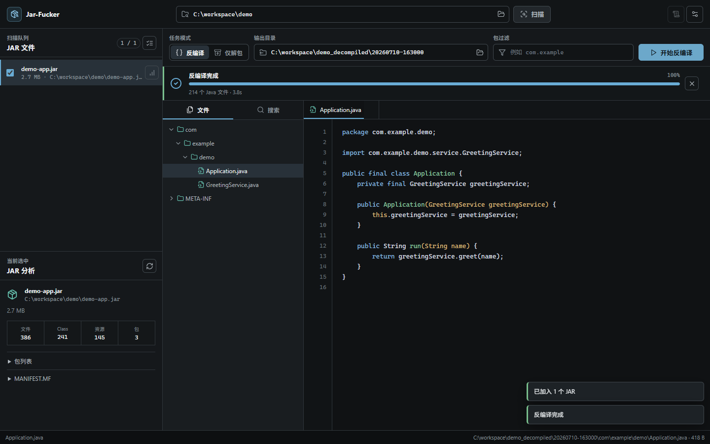

# Jar-Fucker

[](https://github.com/hg0434hongzh0/Jar-Fucker/actions/workflows/ci.yml)

一个面向本地工作的 JAR 分析、解包与 Fernflower 反编译工作台。Web UI、Lucide、highlight.js 和固定版本的 Fernflower 均内嵌在 Go 二进制中；运行时只需要 Java 21+。



## 核心能力

- 扫描目录或拖入多个 JAR，批量选择并查看包、Class、资源和 MANIFEST 信息
- 在“反编译”和“仅解包”之间切换，支持包名前缀过滤
- 流式任务阶段、真实进度、取消、错误日志和输出目录管理
- 结果目录树、多标签源码查看、本地语法高亮、全文搜索与行定位
- 完整离线前端和内嵌 Fernflower，发布包无需额外下载反编译器
- 一键生成并打开 VS Code Java 审计工作区，自动配置反编译源码与 JAR 依赖库
- Windows、Linux、macOS 的响应式工作台和键盘操作

## 安全边界

Jar-Fucker 会读取本机文件并启动 Java，因此本地控制面按高权限工具处理：

- 服务只监听 loopback 地址
- 每次启动生成 256-bit 临时令牌，通过 URL fragment 交给前端
- API 同时校验令牌、`Host`、`Origin` 和浏览器来源信息
- JAR/ZIP 在写出前完整验证路径、类型、条目数、展开量和压缩比
- 上传、JSON、文件查看、搜索和并发任务都有资源上限
- 配置使用临时文件加原子替换，不会先改变运行态再冒险落盘

不要通过反向代理把服务暴露到局域网或公网。自定义 Fernflower JAR/源码目录属于可执行代码，只应选择可信内容；上传的待分析 JAR 不能被直接设置为反编译器。

## 环境要求

- Java JDK/JRE 21 或更高版本
- Go 1.22 或更高版本，仅源码构建时需要

应用会依次检查配置路径、`JAVA_HOME`、`PATH` 和常见 JDK 安装目录。

## 快速开始

从 Release 下载当前平台压缩包，解压后直接运行：

```powershell
# Windows
.\jar-fucker.exe
```

```bash
# Linux / macOS
./jar-fucker
```

应用默认监听 `127.0.0.1:9527` 并打开浏览器。端口被占用时会自动选择空闲端口。

源码构建：

```bash
git clone https://github.com/hg0434hongzh0/Jar-Fucker.git
cd Jar-Fucker
go build -o jar-fucker .
./jar-fucker
```

不自动打开浏览器或指定端口：

```bash
NO_BROWSER=1 PORT=8080 ./jar-fucker
```

PowerShell 对应写法：

```powershell
$env:NO_BROWSER = "1"
$env:PORT = "8080"
.\jar-fucker.exe
```

## 使用流程

1. 输入包含 JAR 的目录并扫描，或把 JAR/目录拖入页面。
2. 在左侧队列选择目标，查看当前 JAR 的结构分析。
3. 选择“反编译”或“仅解包”，按需填写输出目录和包过滤。
4. 运行任务，在结果树中浏览文件，或搜索反编译后的 Java 源码。
5. 反编译完成后点击“在 VS Code 中审计”，自动生成 `.code-workspace`：反编译目录写入 `java.project.sourcePaths`，原 JAR 及源目录中的依赖 JAR 写入 `java.project.referencedLibraries`。

未指定输出目录时，本地目录任务写入带时间戳的 `<源目录>_decompiled` 或 `<源目录>_extracted`。浏览器拖入的文件默认写到用户主目录下的 `Jar-Fucker Output`，避免结果落进临时上传目录。

### 大型 JAR 目录

- 浏览器拖拽导入采用流式写盘，单次上限为 **4096 个 JAR / 2 GiB 请求体**，不会先由 multipart 解析器额外落一份临时副本。
- 对本机大型目录，推荐直接在顶部“源目录”输入绝对路径并点击“扫描”。这种方式不复制 JAR，速度更快、磁盘占用更低。
- 2000 个以上依赖 JAR 可以正常生成 VS Code Java 审计工作区，但 Java Language Server 首次建立索引可能需要较长时间。
- 反编译任务在服务端后台运行；同一浏览器标签页刷新后会自动重新连接并恢复当前进度。
- 单个 JAR 反编译失败时会记录原因并跳过，不再中止整批任务。部分厂商 JAR 中的完全重复文件条目会安全地保留第一份继续处理，路径穿越、符号链接和文件/目录冲突仍会被拒绝。

## 配置

Java 与自定义 Fernflower 路径保存在系统用户配置目录：

- Windows: `%AppData%\Jar-Fucker\config.json`
- Linux: `$XDG_CONFIG_HOME/Jar-Fucker/config.json` 或 `~/.config/Jar-Fucker/config.json`
- macOS: `~/Library/Application Support/Jar-Fucker/config.json`

旧版工作目录中的 `.jar-fucker.json` 会被读取；下一次保存会迁移到系统配置目录。留空即恢复自动检测。

## 开发验证

```bash
go test ./...
go test -race ./...
go vet ./...
go build ./...
```

前端不需要构建器，文件位于 `web/` 并由 `go:embed` 打包。第三方前端资产固定在 `web/vendor/`，运行时没有 CDN 请求。

发布由 GoReleaser 生成 Windows、Linux、macOS 的 amd64/arm64 压缩包和 `checksums.txt`：

```bash
goreleaser release --snapshot --clean
```

推送标准语义版本格式的 `v*` tag（例如 `v2.0.0`）会触发 GitHub Release workflow，并把版本、commit 与构建时间注入二进制。

## API

UI 使用以下本地接口。所有 `/api/*` 请求都必须携带当前启动会话的 `X-Jar-Fucker-Token`，不作为远程服务 API 提供。

| 方法              | 路径                    | 说明                   |
| ----------------- | ----------------------- | ---------------------- |
| `POST`            | `/api/scan`             | 扫描目录中的 JAR       |
| `POST`            | `/api/analyze`          | 分析单个 JAR           |
| `POST`            | `/api/extract`          | 安全批量解包           |
| `POST`            | `/api/decompile/stream` | NDJSON 流式反编译（兼容接口） |
| `POST/GET/DELETE` | `/api/decompile/task`   | 启动、恢复或取消后台反编译任务 |
| `POST` / `DELETE` | `/api/upload`           | 创建或清理临时上传会话 |
| `GET`             | `/api/tree`             | 读取结果目录树         |
| `GET`             | `/api/file`             | 读取结果文件           |
| `POST`            | `/api/search`           | 搜索 Java 源码         |
| `GET`             | `/api/browse`           | 浏览本地目录           |
| `GET` / `PUT`     | `/api/config`           | 读取或原子更新配置     |
| `POST`            | `/api/vscode-workspace` | 生成并打开 VS Code Java 审计工作区 |

## 许可证

项目代码采用 [MIT License](LICENSE)。内嵌 Fernflower 采用 Apache License 2.0，其 [LICENSE](internal/cfr/assets/FERNFLOWER-LICENSE.txt) 与 [NOTICE](internal/cfr/assets/FERNFLOWER-NOTICE.txt) 随源码和发布包分发。Lucide 与 highlight.js 的许可证位于 `web/vendor/`。
